<p align="center">
  
</p>

<h1 align="center">MeetGuard AI</h1>

<p align="center">
  <b>Real-time deepfake and social engineering detection for video meetings.</b>
  <br>
  <sub>Created by <a href="https://github.com/fir3storm">Abhirup Guha</a> — Info Security Solution</sub>
</p>

<p align="center">
  
  
  
  
  
</p>

---

**MeetGuard AI** is a live security assistant that monitors Zoom, Microsoft Teams, and Google Meet calls. It captures the meeting's audio and video via screen capture and system audio loopback, then runs five parallel detectors every 3 seconds to flag executive impersonation attempts — including deepfake faces, voice impersonation, lip-sync drift, fraudulent payment instructions, and social engineering pressure tactics.

This tool is built and maintained by **Abhirup Guha** at **Info Security Solution** for enterprise-grade protection against the rising wave of AI-powered impersonation fraud in video conferencing.

---

## What it detects

| Threat | Detector | What it catches | Score |
|---|---|---|---|
| **Synthetic faces** | Deepfake Face (3DCNN) | Frame-by-frame deepfake generation — real-time face swaps of the CEO | 0–1 |
| **Voice impersonation** | Voice Mismatch (ECAPA-TDNN) | Speaker doesn't match enrolled voiceprints — impostor using a different voice | 0–1 |
| **Desynced audio/video** | Lip-Sync (SyncNet) | Audio doesn't match lip movements — common in low-quality deepfakes | 0–1 |
| **Fraud instructions** | Suspicious NLP (regex + Sentence-BERT) | "Change the vendor account to this new routing number" | 0–1 |
| **Pressure tactics** | Urgency Language (weighted keywords) | "Transfer now — don't tell anyone — this is confidential" | 0–1 |

### Use cases

- **CFO fraud** — impersonator posing as the CEO requests an urgent wire transfer
- **Vendor payment redirection** — fake vendor asks to update payment details to a new account
- **Executive whaling** — socially engineered pressure to bypass approval processes
- **Board meeting security** — monitor sensitive calls for any signs of impersonation

---

## Quick start

### 1. Audio loopback (required once)

MeetGuard captures the **speaker output** (what you hear), not your microphone. You need a virtual audio device:

| OS | Tool | Setup |
|---|---|---|
| **Windows** | [VB-Cable](https://vb-audio.com/Cable/) | Install → set "CABLE Input" as your meeting app's speaker output |
| **macOS** | [BlackHole](https://github.com/ExistentialAudio/BlackHole) | `brew install blackhole-2ch` → create Multi-Output Device in Audio MIDI Setup |
| **Linux** | PulseAudio monitor | `pactl load-module module-loopback` |

Run the setup wizard to verify:
```bash
meetguard --setup-audio
```

### 2. Install

```bash
pip install -r requirements/base.txt
```

Optional: GPU support for faster inference:
```bash
pip install -r requirements/gpu.txt
```

### 3. Download models

```bash
python scripts/download_models.py
```

### 4. Enrol an executive's voiceprint

Record a ~30 second sample of the executive speaking normally:

```bash
meetguard --enroll CEO ceo_voice.wav
meetguard --enroll CFO cfo_voice.wav
```

### 5. Run

```bash
meetguard     # Opens dashboard at http://127.0.0.1:7860
```

On critical detections, you get a desktop notification, an audible alert, and a 30-second video/audio clip saved to `~/.meetguard/sessions/`.

---

## CLI reference

```bash
meetguard [command] [options]

Commands:
  status                    Show engine status and last session summary
  alerts                    List recent detection alerts
  report                    Generate session report
  --setup-audio             Interactive audio loopback setup wizard

Options:
  -c, --config FILE         Path to YAML config file
  -v, --verbose             Debug logging level
  --profile PROFILE         Config profile: high-security, balanced, low-resource
  --dry-run                 Validate config + check dependencies, then exit
  --headless                Run without Gradio dashboard
  --list-audio-devices      List available audio input devices
  --enroll NAME FILE        Enrol a voiceprint from a WAV file
  --version                 Print version and exit
```

### Examples

```bash
meetguard status                      # Check if engine is running
meetguard alerts --limit 20 --json    # Last 20 alerts as JSON
meetguard report --output report.json # Generate session report
meetguard --profile high-security     # Run with stricter thresholds
meetguard --dry-run                   # Validate config and exit
```

---

## Configuration profiles

Quickly switch between operating modes without editing YAML:

| Profile | FPS | Thresholds | Lip-Sync | LLM | Diarization | Use case |
|---|---|---|---|---|---|---|
| **high-security** | 15 | 0.10 / 0.30 / 0.60 | ✅ | ✅ | ✅ | Critical meetings, board calls |
| **balanced** | 5 | 0.20 / 0.45 / 0.75 | ✅ | ❌ | ❌ | Default — everyday use |
| **low-resource** | 3 | 0.30 / 0.55 / 0.85 | ❌ | ❌ | ❌ | Laptop, limited CPU |

```bash
meetguard --profile high-security
```

---

## Architecture

```
Every 200ms:  screen grab (5 FPS) + audio loopback (16kHz)
                    │
                    ▼  Every 3 seconds
         ┌─────────────────────┐
         │  Diarization (opt)  │── isolate speakers → per-speaker voice scoring
         │                     │
         │   5 Detectors       │
         │  • Face (3DCNN)     │──→ deepfake score
         │  • Voice (ECAPA)    │──→ mismatch score
         │  • Lip (SyncNet)    │──→ drift score
         │  • NLP (BERT)       │──→ suspicious score
         │  • Urgency (RE)     │──→ pressure score
         └────────┬────────────┘
                  ▼
         ┌─────────────────────┐
         │   Fusion Engine     │──→ total_risk (weighted sum)
         │   Classifier        │──→ SAFE / MONITOR / SUSPICIOUS / CRITICAL
         └────────┬────────────┘
                  ▼
         ┌─────────────────────┐
         │     Alerting        │
         │  • Desktop popup    │
         │  • Sound alert      │
         │  • Save 30s clip    │
         │  • Webhooks         │
         │  • SQLite log       │
         └─────────────────────┘
```

---

## API

When running, MeetGuard serves a REST API on port **8573**:

```bash
curl http://127.0.0.1:8573/api/v1/status
curl http://127.0.0.1:8573/api/v1/status/risk
curl http://127.0.0.1:8573/api/v1/alerts?limit=10
curl http://127.0.0.1:8573/api/v1/voiceprints
```

WebSocket at `ws://127.0.0.1:8573/ws` streams real-time updates.

---

## Configuration

All thresholds and weights are in `config/default.yaml`:

```yaml
fusion:
  weights:
    face: 0.30    # 30% weight in total risk score
    voice: 0.25
    lip: 0.15
    nlp: 0.20
    urgency: 0.10
  thresholds:
    monitor: 0.20
    suspicious: 0.45
    critical: 0.75    # ≥ 0.75 triggers desktop alert + clip + webhooks
```

Webhook integration for real-time alerting:

```yaml
alerting:
  webhooks:
    slack_url: "https://hooks.slack.com/services/T00/B00/xxx"
    discord_url: "https://discord.com/api/webhooks/xxx"
    email:
      smtp_host: "smtp.gmail.com"
      from_addr: "meetguard@yourcompany.com"
      to_addrs: ["security@yourcompany.com"]
```

---

## Project structure

```
meetguard/
├── cli/               # CLI subcommands (status, alerts, report)
├── capture/           # Screen + audio capture, ring buffers, audio wizard
├── processing/        # Face extraction, voiceprint, transcription, diarization
├── detectors/         # 5 detection modules + LLM fallback
├── fusion/            # Risk aggregation, classification, alert rules
├── alerting/          # Notifications, webhooks, recording, dashboard server
├── api/               # REST API (FastAPI router)
├── storage/           # SQLite voiceprints + session logs
├── ui/                # Gradio dashboard (with performance metrics)
├── utils/             # Data models, logging
├── config.py          # YAML config loader + validator
├── profiles.py        # Configuration profiles
└── main.py            # Entry point, engine, CLI
```

---

## About the author

Built by **Abhirup Guha** at **Info Security Solution**.

Info Security Solution specializes in cybersecurity tools for detecting AI-powered threats, including deepfake impersonation, social engineering, and financial fraud in enterprise communication channels.

- GitHub: [@fir3storm](https://github.com/fir3storm)
- Project: [MeetGuard AI](https://github.com/fir3storm/MeetGuard-AI)

---

## License

MIT — see [LICENSE](LICENSE).

Copyright (c) 2026 Abhirup Guha — Info Security Solution
